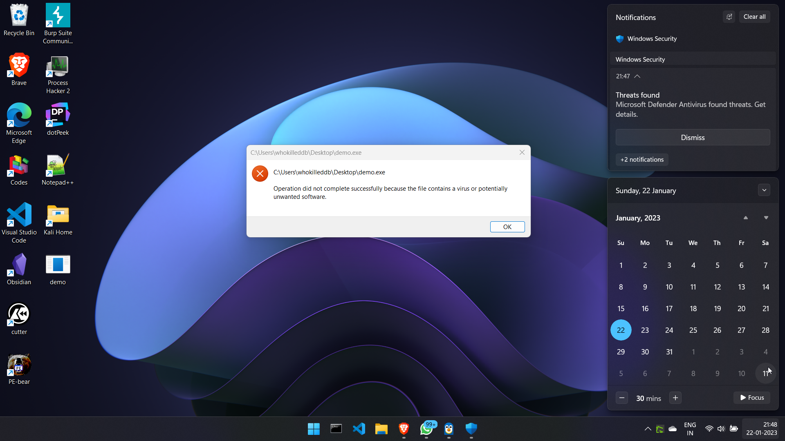
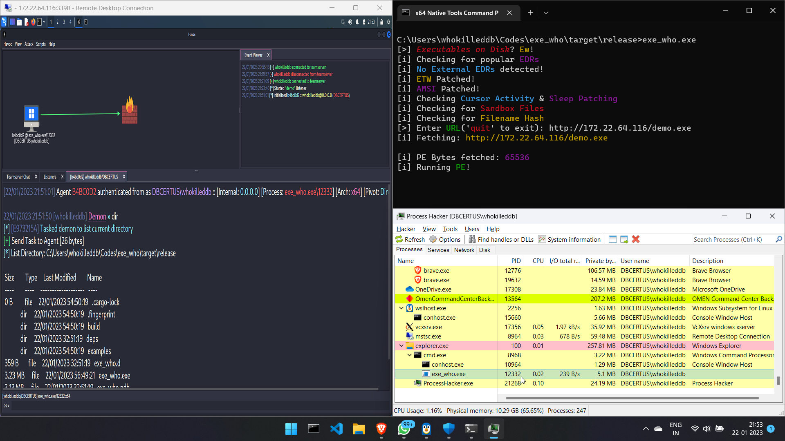
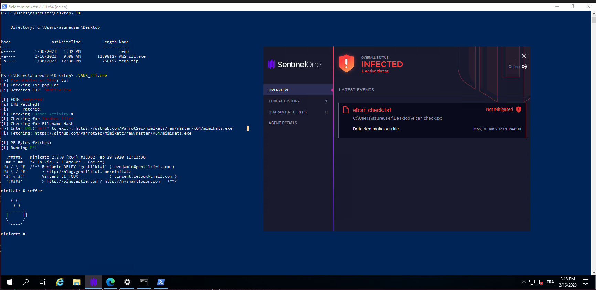

# Executables on Disk? _Preposterous!_

Saving executables to disk is like telling EDRs that _"Hey! Take a look at this thing I just fetched from the Internet!"_. No Red-Teamer wants that at the end of the day. That's why we are here to help!

For example, [Havoc](https://github.com/HavocFramework/Havoc) native payloads get flagged by the defender pretty easy:

 
However, you can run the same in-memory without spawnning a new process using the repository as:


Here in an example of the tool bypassing `SentinelOne` to run `mimikatz`

 
# Compile and Build!
Compiling is as easy as:
```bash
C:\Users\User\Codes\exe_who> cargo build --release
```


## Cross compilation
Build Windows binary from Ubuntu Linux
- `sudo apt install libssl-dev`
- `cargo build --target x86_64-pc-windows-gnu --release`

Build Windows static binary from Ubuntu Linux
- `sudo apt install libssl-dev`
- `RUSTFLAGS="-C target-feature=+crt-static" cargo build --release --target x86_64-pc-windows-gnu` 

# Current Features
- Patch ETW
- Patch AMSI
- Sandbox Detection
  - User Activity Detection
  - Check for Sandbox Drivers
  - Check for Sleep Patching
  - Check Filename Hash
- Check for EDR drivers
- Fetch PEs and DLLs and run them in-memory

# TODO
- [X] Update README.md with cross compilation instructions
- [X] Update vulnerable crates: rust-crypto, time, rustc-serialize
- [X] Update outdated non-vulnerable crates: windows
- [X] Cargo fmt
- [X] Cargo clippy
- [X] Ditch rust-crypto for maintained crates : [MD5](https://github.com/RustCrypto/hashes/tree/master/md5), [SHA1](https://github.com/RustCrypto/hashes/tree/master/sha1), [SHA2](https://github.com/RustCrypto/hashes/tree/master/sha2)